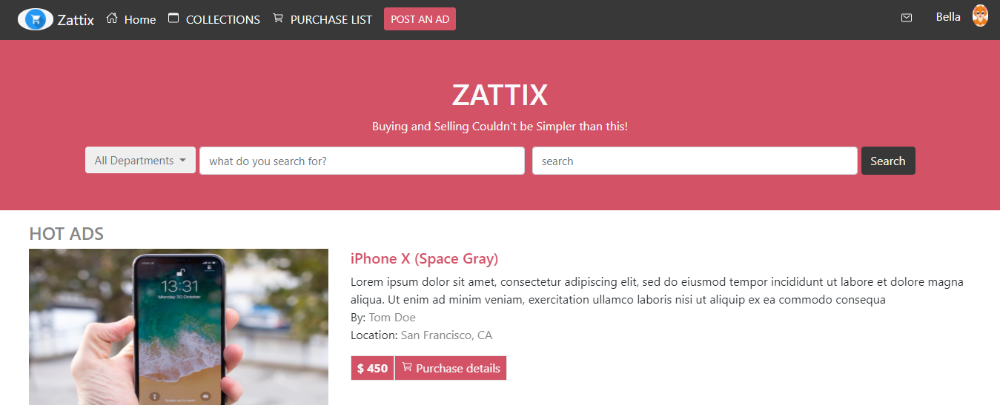

# Capestone-HTML-CSS

### **Description:** 

Project describes Zattix home page, it shows a Login user on the top-right corner, a main section with Hot Ads, different shopping products and related information and a footer section.
 
 **Header (Navbar section):**
 
 	- A Navbar with multiple options based on user's preference.
 	- A button for Post an ad.
    - A Login user ID on the top-right corner.
 	
 **Main section:**
 
 	- Embedded images related to deals and many different URLs for further information.
 	- Hot Ads with latest deals.
 	- Electronics, Pets, Fashion section related info. 
 	- A search button shows information according to User's preference.
 	
 **Footer section:**
    - Categories and Navigation options related to User's preference.
 	- URLs redirecting to Legal, Privacy, and Security sites with further information.
 	
	
 ### **Tools used:**
 
 HTML5, and CSS3.
 
 
 
[Live demo link](https://gango-anan.github.io/newsweek-bootstrap/)

 
 
### **Getting Started:**

Zattix Shoping page including a Header, Main and Footer sections.

 ### **Requirements:** 
 - OS: Windows, Linux, or Mac.
 - Browser: Google Chrome, Mozilla Firefox, Edge, etc.
 

### **Set up:**

You can download the code or clone the repository to your local system.

## **Authors:**

👤 Varun Sharma

GitHub: [@Varun2323](https://github.com/Varun2323)

LinkedIn: [Varun Sharma](https://www.linkedin.com/in/varun-sharma-82b29b82/)

  
## **Show your support**

Spread the word if you like this project.

## **Acknowledgments**

Thanks to - [W3Schools](http://w3schools-fa.ir)